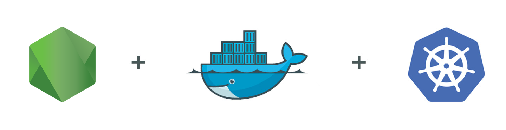
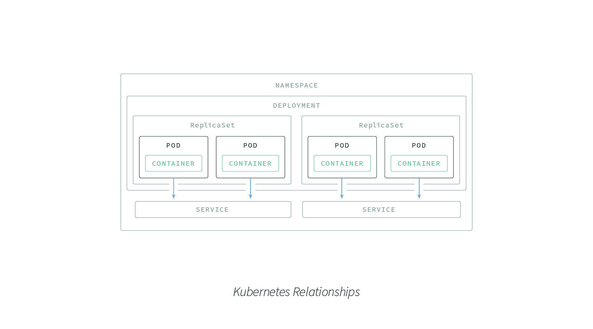

## Overview

This repository is for deploying a simple [Node.js](https://nodejs.org/en/) application with [Kubernetes](http://kubernetes.io/) to [Gogle Kubernetes Engine](https://cloud.google.com/kubernetes-engine/), and accompanies a [detailed article]() on the [NodeSource](https://nodesource.com) [blog](https://nodesource/com/blog).

